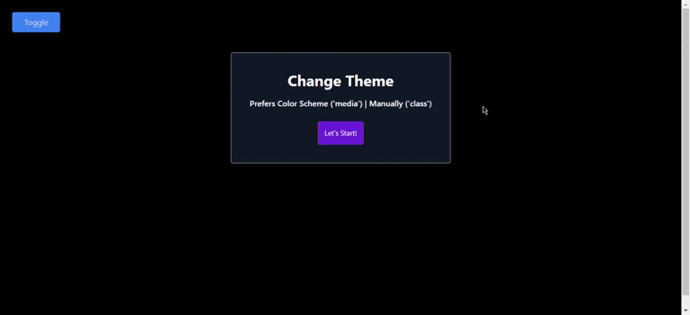
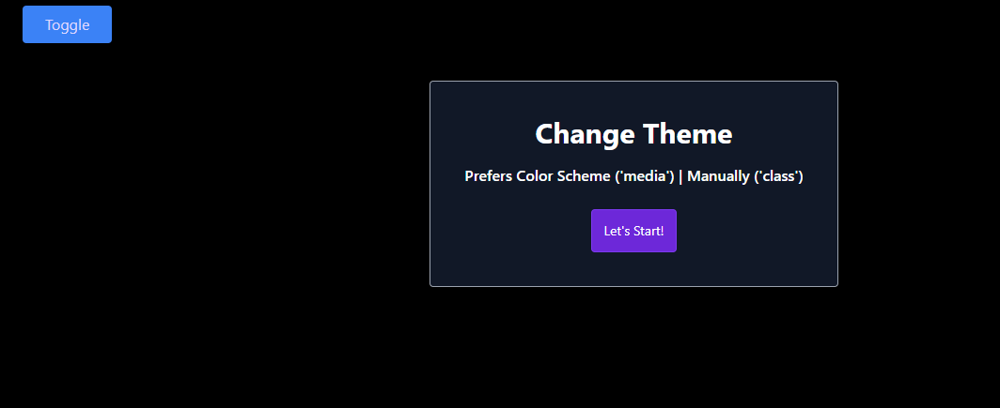

## Project: Change Theme App


## Animation of the App



## Visulation of the App



## Description
```bash
- User switches theme as dark or light
```

## Overview
I mastered HTML, CSS, Javascript and Tailwind CSS features in this project. You can see the visual representation of the app above.

## Technologies 💻
```bash
- Javascript
- Postcss Plugin
- Tailwind CSS

```
